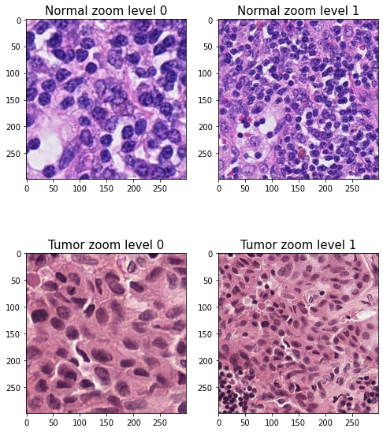

# Detect tumor in gigapixel pathology images
<b>Columbia University Applied Deep Learning Course Project</b> 
<b>Author:</b> Wenrui Huang 
<b>Date: </b> 2021-12-31 
## Motivation
- Each year, treatment decision of overall 230, 000 breast cancer patients in the US hinge on whether tumor has metastasized.
- Detection of metastasis is often a daunting task that involves well-trained pathologists reviewing an extensive amount of tissues.
- The whole process is tedious and error-prone and can only achieve ~73% sensitivity in tumor detection.
- <b>I thus propose a deep learning model that automates tumor detection in histological slides with a similar or better performance than human in order to facilitate clinical cancer diagnosis and treatment.</b>  
## Data Source
21 Gigapixal pathology image sets originate from [The CAMELYON16 CHALLENGE](https://camelyon16.grand-challenge.org/Data/) Dataset, in which each image set consists of a histological slide and corresponding mask that indiates tumor tissue, both in .tiff format. Each slide and mask contains seven zoom levels, in which 0 is the base zoom level and 7 is the highest. 
## Data Preprocessing
1. Split 16 images as train, 2 as validation and the rest 3 as test datasets.
2. Random sample 8000 patches (4000 for each of the two zoom levels) from the train images and 1600 patches (800 for each of the two zoom levels) from the validation images based on the following rules: 
   - Patch size is 299 X 299;
   - Percentage of tissue pixels in each patch should be >= 30%;
   - Random number of patch centroids will be sampled from each image according to Multinomial(N patches/2, 1/(N images)) distribution;
   - For every centroid, two patches will be selected, one for each zoom level. Those patches, despite different zoom levels, are centered at the same location in the slide image;
   - Check if the center (128 X 128) region of a patch has tumor pixels. If yes, label the patch as tumor (1), otherwise, normal (0). 
3. Below is an example of normal and tumor patches sampled from zoom level 0 and zoom level 1 of the same slide. 
 
## Reference
Liu, Y, et al. Detecting cancer metastases on gigapixel pathology images. *<b>arXiv preprint</b>* arXiv:1703.02442 (2017). [link to paper](https://arxiv.org/pdf/1703.02442.pdf)
